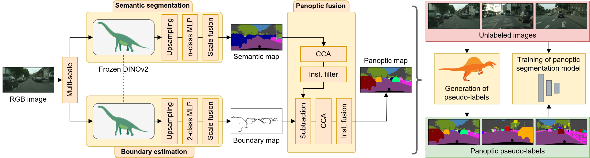

# SPINO: Few-Shot Panoptic Segmentation With Foundation Models
[**arXiv**](https://arxiv.org/abs/2309.10726) | [**IEEE Xplore**](https://ieeexplore.ieee.org/document/10611624) | [**Website**](http://spino.cs.uni-freiburg.de/) | [**Video**](https://www.youtube.com/watch?v=3GCd4TsQktE)

This repository is the official implementation of the paper:

> **Few-Shot Panoptic Segmentation With Foundation Models**
>
> [Markus Käppeler](https://rl.uni-freiburg.de/people/kaeppelm)&ast;, [Kürsat Petek](http://www2.informatik.uni-freiburg.de/~petek/)&ast;, [Niclas Vödisch](https://vniclas.github.io/)&ast;, [Wolfram Burgard](https://www.utn.de/person/wolfram-burgard/), and [Abhinav Valada](https://rl.uni-freiburg.de/people/valada). <br>
> &ast;Equal contribution. <br>
>
> *IEEE International Conference on Robotics and Automation (ICRA)*, 2024

<p align="center">
  
</p>

If you find our work useful, please consider citing our paper:
```
@inproceedings{kaeppeler2024spino,
    title={Few-Shot Panoptic Segmentation With Foundation Models},
    author={Käppeler, Markus and Petek, Kürsat and Vödisch, Niclas and Burgard, Wolfram and Valada, Abhinav},
    booktitle={IEEE International Conference on Robotics and Automation (ICRA)},
    year={2024},
    pages={7718-7724}
}
```


## 📔 Abstract

Current state-of-the-art methods for panoptic segmentation require an immense amount of annotated training data that is both arduous and expensive to obtain posing a significant challenge for their widespread adoption. Concurrently, recent breakthroughs in visual representation learning have sparked a paradigm shift leading to the advent of large foundation models that can be trained with completely unlabeled images. In this work, we propose to leverage such task-agnostic image features to enable few-shot panoptic segmentation by presenting Segmenting Panoptic Information with Nearly 0 labels (SPINO). In detail, our method combines a DINOv2 backbone with lightweight network heads for semantic segmentation and boundary estimation. We show that our approach, albeit being trained with only ten annotated images, predicts high-quality pseudo-labels that can be used with any existing panoptic segmentation method. Notably, we demonstrate that SPINO achieves competitive results compared to fully supervised baselines while using less than 0.3% of the ground truth labels, paving the way for learning complex visual recognition tasks leveraging foundation models. To illustrate its general applicability, we further deploy SPINO on real-world robotic vision systems for both outdoor and indoor environments.

## 👩‍💻 Code

### 🏗 Setup

#### ⚙️ Installation

1. Create conda environment: `conda create --name spino python=3.8`
2. Activate environment: `conda activate spino`
3. Install dependencies: `pip install -r requirements.txt`
4. Install torch, torchvision and cuda: `pip install torch==1.10.1+cu111 torchvision==0.11.2+cu111 torchaudio==0.10.1 -f https://download.pytorch.org/whl/cu111/torch_stable.html`
5. Compile deformable attention: `cd panoptic_segmentation_model/external/ms_deformable_attention & sh make.sh`

#### 💻 Development

1. Install [pre-commit](https://pre-commit.com/) githook scripts: `pre-commit install`
2. Upgrade isort to 5.12.0: `pip install isort`
3. Update pre-commit: `pre-commit autoupdate`
4. Linter ([pylint](https://pypi.org/project/pylint/)) and formatter ([yapf](https://github.com/google/yapf), [iSort](https://github.com/PyCQA/isort)) settings can be set in [pyproject.toml](pyproject.toml).

### 🏃 Running the Code

#### 🎨 Pseudo-label generation

To generate pseudo-labels for the [Cityscapes](#cityscapes) dataset, please set the path to the dataset in the configuration files (see list below).
Then  execute [run_cityscapes.sh](panoptic_label_generator/run_cityscapes.sh) from the root of the `panoptic_label_generator` folder.
This script will perform the following steps:
1. Train the semantic segmentation module using the configuration file [configs/semantic_cityscapes.yaml](panoptic_label_generator/configs/semantic_cityscapes.yaml).
2. Train the boundary estimation module using the configuration file [configs/boundary_cityscapes.yaml](panoptic_label_generator/configs/boundary_cityscapes.yaml).
3. Generate the panoptic pseudo-labels using the configuration file [configs/instance_cityscapes.yaml](panoptic_label_generator/configs/instance_cityscapes.yaml).

We also support the [KITTI-360](#kitti-360) dataset. To generate pseudo-labels for KITTI-360, please adapt the corresponding configuration files.

Instead of training the modules from scratch, you can also use the pretrained weights provided at these links:
- Cityscapes: https://drive.google.com/file/d/1FjJYpkEO9enpsahevD8PMn3nP_O0sNnT/view?usp=sharing
- KITTI-360: https://drive.google.com/file/d/1Eod444VoRLKw6dOeDSLuvfUQlJ5FAwM_/view?usp=sharing

#### 🧠 Panoptic segmentation model

To train a panoptic segmentation model on a given dataset, e.g., the generated pseudo-labels, execute [train.sh](panoptic_segmentation_model/scripts/train.sh).

Before running the code, specify all settings:
1. ***python_env***: Set the name of the conda environment (e.g. "spino")
2. ***alias_python***: Set the path of the python binary to be used
3. ***WANDB_API_KEY***: Set the wand API key of your account
4. ***CUDA_VISIBLE_DEVICES*** Specifies the device ids of available GPUs
5. Set all remaining arguments:
   - ***nproc_per_node***: Number of processes per node (usually node=GPU server), this should be equal to the number of devices specified in _CUDA_VISIBLE_DEVICES_
   - ***master_addr***: IP address of GPU server to run the code on
   - ***master_port***: Port to be used for server access
   - ***run_name***: Name of the current run, a folder will be created with this name including all the files to be created (pretrained weights, config file etc.) and this name will also appear on wandb
   - ***project_root_dir***: Path to where the folder with the run name will be created
   - ***mode***: Mode of the training, can be "train" or "eval"
   - ***resume***: If specified, the training will be resumed from the specified checkpoint
   - ***pre_train***: Only load the specified modules from the checkpoint
   - ***freeze_modules***: Freeze the specified modules during training
   - ***filename_defaults_config***: Filename of the default configuration file with all configuration parameters
   - ***filename_config***: Filename of the configuration file that acts relative to the default configuration file
   - ***comment***: Some string
   - ***seed***: Seed to initialize "torch", "random", and "numpy"
6. Set available flags:
   - ***eval***: Only evaluate the model specified by ***resume***
   - ***debug***: Start the training in debug mode

Additionally,
1. ensure that the dataset path is set correctly in the corresponding config file, e.g., [train_cityscapes_dino_adapter.yaml](panoptic_segmentation_model/cfg/train_cityscapes_dino_adapter.yaml).
2. set the `entity` and `project` parameters for `wandb.init(...)` in [misc/train_utils.py](panoptic_segmentation_model/misc/train_utils.py).

### 💾 Datasets

#### [Cityscapes](https://www.cityscapes-dataset.com/)

Download the following files:
- leftImg8bit_sequence_trainvaltest.zip (324GB)
- gtFine_trainvaltest.zip (241MB)
- camera_trainvaltest.zip (2MB)

After extraction, one should obtain the following file structure:
```
── cityscapes
   ├── camera
   │    └── ...
   ├── gtFine
   │    └── ...
   └── leftImg8bit_sequence
        └── ...
```

#### [KITTI-360](https://www.cvlibs.net/datasets/kitti-360/index.php)

Download the following files:
- Perspective Images for Train & Val (128G): You can remove "01" in line 12 in `download_2d_perspective.sh` to only download the relevant images.
- Test Semantic (1.5G)
- Semantics (1.8G)
- Calibrations (3K)

After extraction and copying of the perspective images, one should obtain the following file structure:
```
── kitti_360
   ├── calibration
   │    ├── calib_cam_to_pose.txt
   │    └── ...
   ├── data_2d_raw
   │   ├── 2013_05_28_drive_0000_sync
   │   └── ...
   ├── data_2d_semantics
   │    └── train
   │        ├── 2013_05_28_drive_0000_sync
   │        └── ...
   └── data_2d_test
        ├── 2013_05_28_drive_0008_sync
        └── 2013_05_28_drive_0018_sync
```

## 👩‍⚖️  License

For academic usage, the code is released under the [GPLv3](https://www.gnu.org/licenses/gpl-3.0.en.html) license.
For any commercial purpose, please contact the authors.


## 🙏 Acknowledgment

This work was funded by the German Research Foundation (DFG) Emmy Noether Program grant No 468878300 and the European Union’s Horizon 2020 research and innovation program grant No 871449-OpenDR.
<br><br>
<p float="left">
  <a href="https://www.dfg.de/en/research_funding/programmes/individual/emmy_noether/index.html"></a>
  &nbsp;
  &nbsp;
  &nbsp;
  <a href="https://opendr.eu/"></a>
</p>
