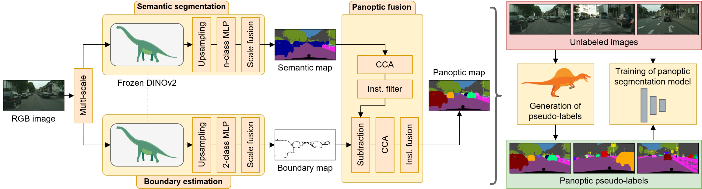

# SPINO: Few-Shot Panoptic Segmentation With Foundation Models
[**arXiv**](https://arxiv.org/abs/2309.10726) | [**Website**](http://spino.cs.uni-freiburg.de/)

This repository is the official implementation of the paper:

> **Few-Shot Panoptic Segmentation With Foundation Models**
>
> [Markus Käppeler]()&ast;, [Kürsat Petek](http://www2.informatik.uni-freiburg.de/~petek/)&ast;, [Niclas Vödisch](https://vniclas.github.io/)&ast;, [Wolfram Burgard](https://www.utn.de/person/wolfram-burgard/), and [Abhinav Valada](https://rl.uni-freiburg.de/people/valada). <br>
> &ast;Equal contribution. <br> 
> 
> *arXiv preprint arXiv:2309.10726*, 2023

<p align="center">
  
</p>

If you find our work useful, please consider citing our paper:
```
@article{kaeppeler2023spino,
  title={Few-Shot Panoptic Segmentation With Foundation Models},
  author={Käppeler, Markus and Petek, Kürsat and Vödisch, Niclas and Burgard, Wolfram and Valada, Abhinav},
  journal={arXiv preprint arXiv:2309.10726},
  year={2023}
}
```


## 📔 Abstract

Current state-of-the-art methods for panoptic segmentation require an immense amount of annotated training data that is both arduous and expensive to obtain posing a significant challenge for their widespread adoption. Concurrently, recent breakthroughs in visual representation learning have sparked a paradigm shift leading to the advent of large foundation models that can be trained with completely unlabeled images. In this work, we propose to leverage such task-agnostic image features to enable few-shot panoptic segmentation by presenting Segmenting Panoptic Information with Nearly 0 labels (SPINO). In detail, our method combines a DINOv2 backbone with lightweight network heads for semantic segmentation and boundary estimation. We show that our approach, albeit being trained with only ten annotated images, predicts high-quality pseudo-labels that can be used with any existing panoptic segmentation method. Notably, we demonstrate that SPINO achieves competitive results compared to fully supervised baselines while using less than 0.3% of the ground truth labels, paving the way for learning complex visual recognition tasks leveraging foundation models. To illustrate its general applicability, we further deploy SPINO on real-world robotic vision systems for both outdoor and indoor environments.


## 👩‍💻 Code

We will release the code upon the acceptance of our paper.


## 👩‍⚖️  License

For academic usage, the code is released under the [GPLv3](https://www.gnu.org/licenses/gpl-3.0.en.html) license.
For any commercial purpose, please contact the authors.


## 🙏 Acknowledgment

This work was funded by the German Research Foundation (DFG) Emmy Noether Program grant No 468878300 and the European Union’s Horizon 2020 research and innovation program grant No 871449-OpenDR.
<br><br>
<a href="https://opendr.eu/"></a>
